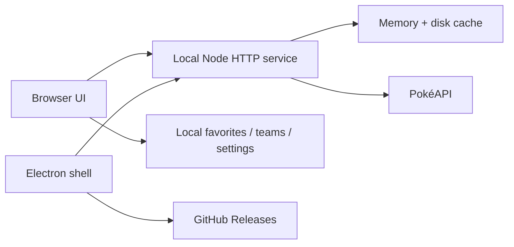

# POKÉGRID — Field Research System

[](https://github.com/MatheusCamacho/pokegrid/releases/latest)
[](https://github.com/MatheusCamacho/pokegrid/releases/latest)
[](https://www.electronjs.org/)
[](LICENSE)

A desktop Pokémon field-research interface for species exploration, team composition, move coverage and comparison.

**Project by Matheus Camacho. AI was used as a support tool during development.**

## Download

No VS Code, Node.js or npm is required to use the packaged application.

| Platform | Build |
| --- | --- |
| Windows · Portable | **[Download POKÉGRID Portable](https://github.com/MatheusCamacho/pokegrid/releases/latest/download/POKEGRID-Portable-1.3.0-x64.exe)** |
| Windows · Installer | **[Download POKÉGRID Setup](https://github.com/MatheusCamacho/pokegrid/releases/latest/download/POKEGRID-Setup-1.3.0-x64.exe)** |
| Linux · AppImage | **[Download POKÉGRID AppImage](https://github.com/MatheusCamacho/pokegrid/releases/latest/download/POKEGRID-1.3.0-x86_64.AppImage)** |

The Windows Portable build is also tracked in `downloads/` with Git LFS. When **Include Git LFS objects in archives** is enabled in the repository settings, **Code → Download ZIP** contains the real executable.

## What it does

POKÉGRID treats Pokémon as a research dataset rather than a traditional card Pokédex.

- Full searchable Pokémon index, including **Mega, Gigantamax and alternate forms**
- Natural form search such as `mega charizard`
- Filters by **type** and **generation**
- Dedicated **generation archive**
- Detailed specimen sheets with stats, abilities, forms and evolution data
- English / **Português (Brasil)** interface
- Local **Favorites**
- Team Lab with up to six Pokémon
- **Saved teams** stored locally
- Defensive pressure matrix for all 18 types
- Team composition heuristic
- **Move Lab** with up to four selected moves per Pokémon
- Move-based offensive coverage, STAB and physical/special/status distribution
- Side-by-side Pokémon comparison
- Persistent API cache with stale offline fallback
- Optional minimal interface sounds
- About/System panel with author, runtime and update status
- GitHub Release update channel for packaged desktop builds
- Windows installer, Windows Portable and Linux AppImage

## Design

The interface is intentionally closer to a field archive / technical specimen catalogue than a conventional dashboard.

No component library, Tailwind, React or frontend framework is used. The interface is built with semantic HTML, CSS and modular browser JavaScript.

## Architecture



The desktop build starts the API service only on `127.0.0.1` using an ephemeral port. Electron keeps Node integration disabled in the renderer, enables context isolation and sandboxing, and exposes only the small desktop bridge needed for system/update information.

More detail: [`docs/ARCHITECTURE.md`](docs/ARCHITECTURE.md).

## Team analysis

The original Team Lab analysis reads:

- shared defensive weaknesses
- resistances and immunities
- native type diversity
- average base stats
- native STAB pressure

The **Move Lab** adds a second layer. Selected moves are resolved against PokéAPI and the app calculates:

- super-effective move coverage across all 18 defending types
- uncovered type gaps
- STAB move count
- physical / special / status distribution

The composition score is a project heuristic, **not** a competitive ranking.

## Forms and search

POKÉGRID resolves a Pokémon form through the species reference returned by PokéAPI. This is important for forms whose Pokémon IDs do not match species IDs, including Mega Evolutions.

Examples:

```text
mega charizard
charizard-mega-x
venusaur mega
pikachu gmax
149
```

## Saved data

These features stay on the local machine:

- active Team Lab
- saved teams
- selected moves
- favorites
- language
- sound preference
- persistent PokéAPI cache

No account is required.

## Updates

The installed Windows build uses the GitHub Releases update channel. When a newer release is available, the app can download it and install it when the application closes.

The Portable build checks the latest release and points users to the release channel because Portable is not an auto-updatable Windows target in electron-builder. The NSIS installer is the recommended build if automatic updating is desired.

## Development

Requires Node.js 20.10 or newer.

```bash
npm install
npm start
```

Browser version:

```text
http://localhost:3000
```

Electron development shell:

```bash
npm run desktop
```

Validation:

```bash
npm run check
npm test
```

Package:

```bash
npm run dist:win
npm run dist:linux
```

## Repository structure

```text
pokegrid/
├── .github/workflows/
├── assets/
├── desktop/
│   ├── main.mjs
│   └── preload.cjs
├── docs/
├── public/
├── src/
│   ├── cache.mjs
│   ├── disk-cache.mjs
│   ├── pokeapi.mjs
│   ├── server.mjs
│   └── team-analysis.mjs
├── test/
├── downloads/
├── electron-builder.yml
└── package.json
```

## Author

**Matheus Camacho**

[GitHub](https://github.com/MatheusCamacho) · [LinkedIn](https://www.linkedin.com/in/matheus-boanova-camacho-34193b357/)

> Concept, design direction and project by Matheus Camacho. AI was used as a support tool during development.

## Data and trademarks

Pokémon data is provided by [PokéAPI](https://pokeapi.co/).

Pokémon and Pokémon character names are trademarks of Nintendo, Game Freak and The Pokémon Company. POKÉGRID is a non-commercial fan project and is not affiliated with those companies.

The POKÉGRID source code is released under the [MIT License](LICENSE).
